# ARSW-LAB01

## 🖊️ Objective

---
 
The objective of this lab is to introduce threaded programming in Java, as well as its application to a specific case.

### Prerequisites

---

Make sure you have the following installed:

- [Java JDK 8+](https://www.oracle.com/java/technologies/javase-downloads.html)
- [Apache Maven](https://maven.apache.org/)

### Installing

---

1. Clone this repository on your local machine:
   ```bash
    git clone <URL_DEL_REPOSITORIO>
    ```
2. Navigate to the project directory
    ```bash
    cd <NOMBRE_DEL_PROYECTO>
    ```

3. Run the project.

## Built With

* [Maven](https://maven.apache.org/) - Dependency Management
* [Java](https://www.oracle.com/java/) - Programming Language

## 🧵 Part 1 : Introduction to Threads in Java

---

### Part 1.2 Based on what you've read, complete the CountThread classes so that they define the lifecycle of a thread that prints the numbers between A and B to the screen.

---


### Part 1.1: Complete the main method of the CountMainThreads class so that:

---

### Create 3 CountThread threads, assigning the first the range [0..99], the second [99..199], and the third [200..299].


### Start all three threads with 'start()'.


### Run the program and review the output on the screen.


### Change the start with 'start()' to 'run()'. How does the output change? Why?
The output is executed thread by thread until it reaches the final value of the last one, in this case 299, because what start (concurrent) does is execute the threads without a specific order, so they will execute without this order, while with run it executes in the assigned order or commonly called sequential execution in this main

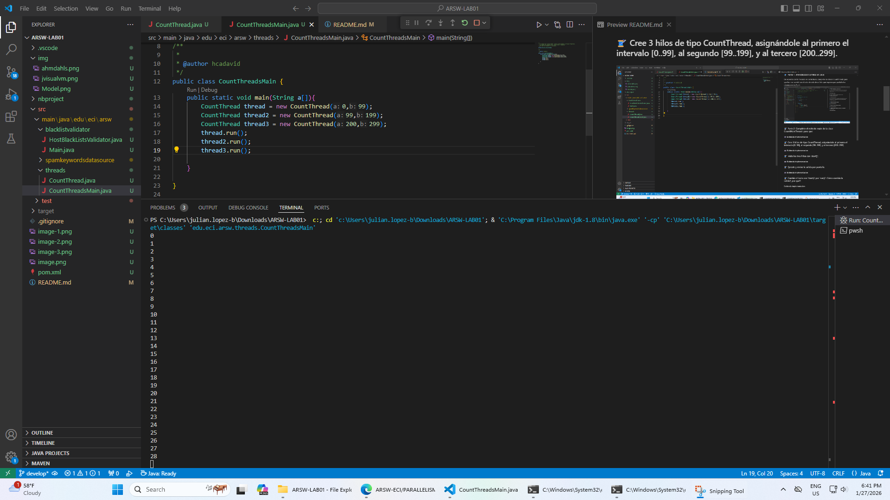

## 🧵 Part 2 : Exercise Black List Search

---

### Part 2.1. Create a Thread class that represents the lifecycle of a thread searching for a segment of the available server pool. Add a method to this class that allows you to query the instances of the threads for how many instances of malicious servers they have found or have found.


---

### Part 2.2

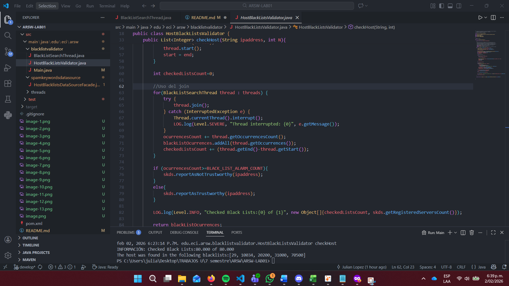

---


## 🧵 Part 3 : Performance Evaluation

Based on the above, implement the following sequence of experiments to validate sparse IP addresses (e.g., 202.24.34.55), recording the execution times (make sure to do them on the same machine):

## Personal Computer

### Test 1 Thread

The CPU worked around 0.0% - 0.7%

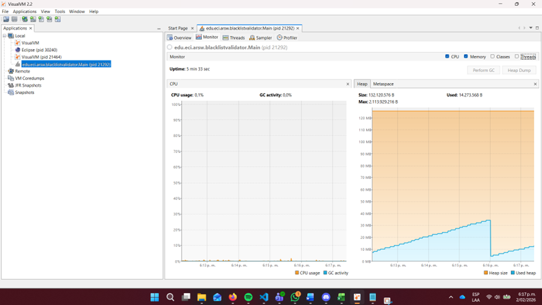
---


### Test # Of Cores

In this case my laptop have 8 so the test gonna be with this value
The CPU worked around
 
The CPU worked around 0.0% - 2.8%

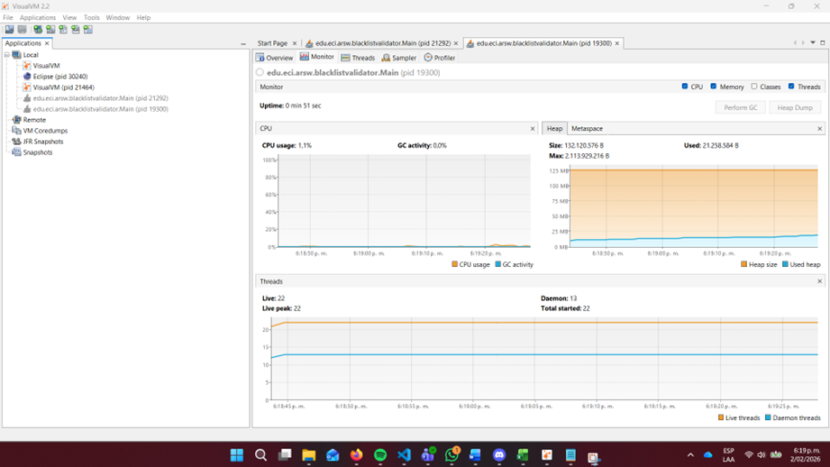
---

---

### Test # Of Cores x 2

The CPU worked around 0.0% - 4.0%

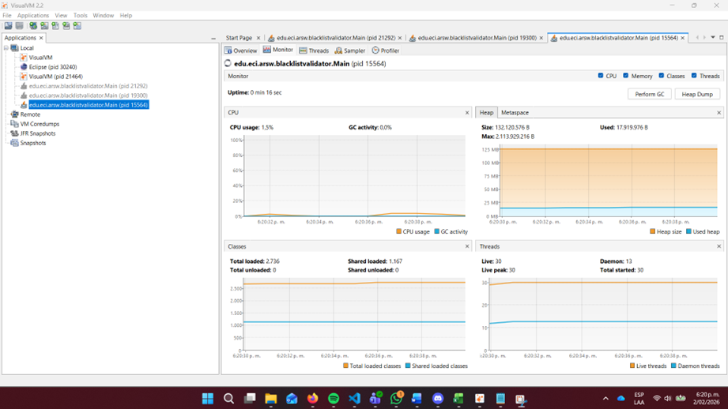
---
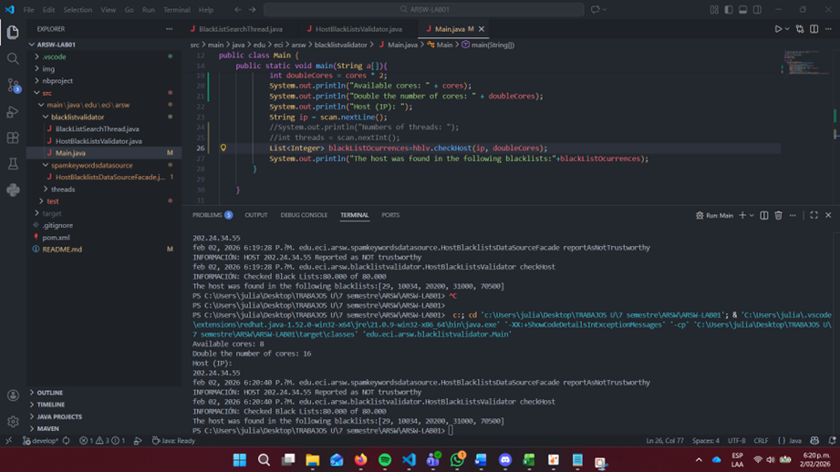

### Test 50 Threads

The CPU worked around 0.0%


---
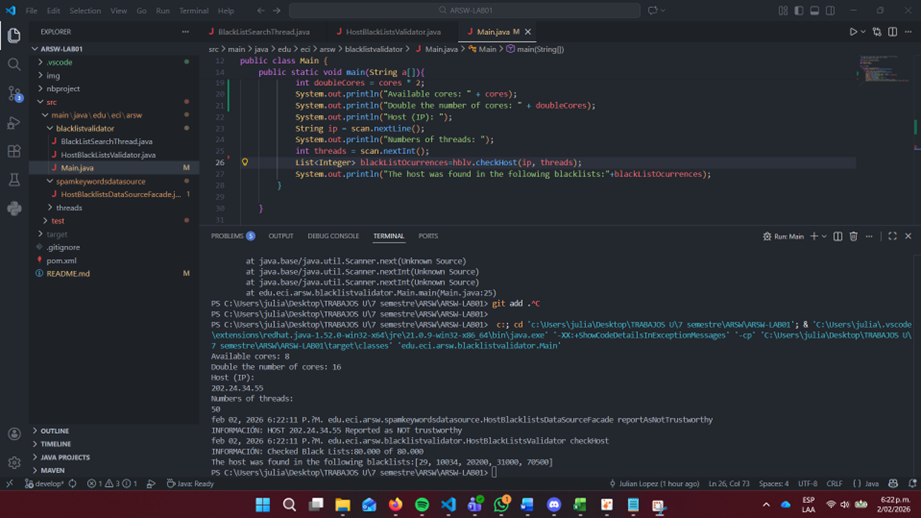

### Test 100 Threads

The CPU worked around 0.0%

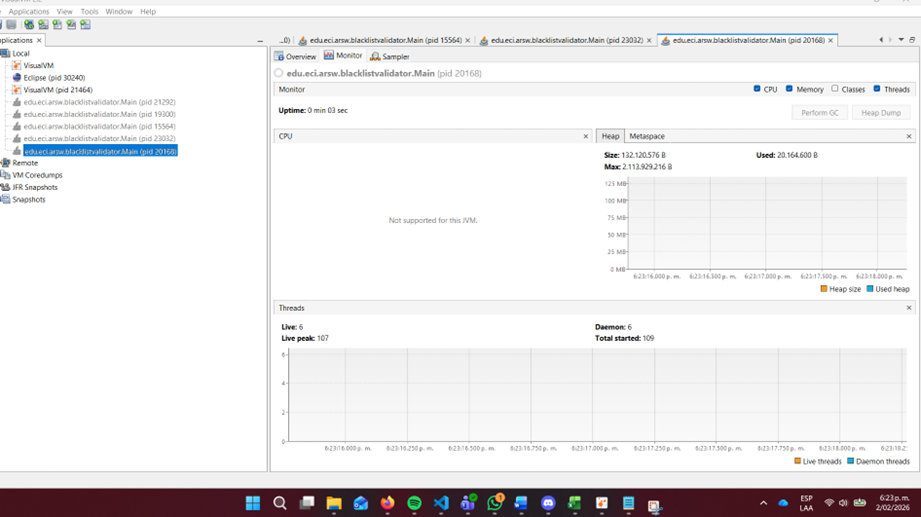
---
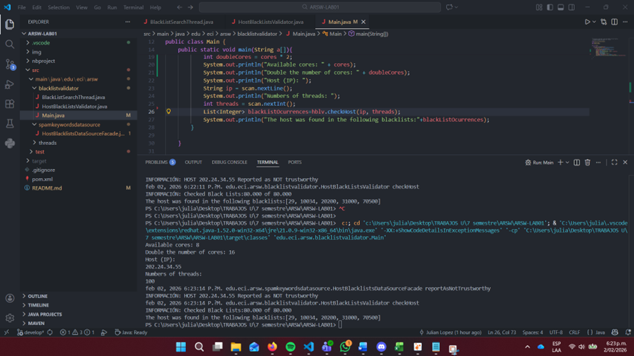

## Graph of solution time(ms) vs. number of threads Personal Computer

### Data

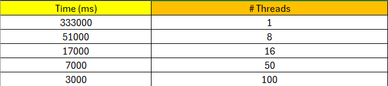

### Graphic

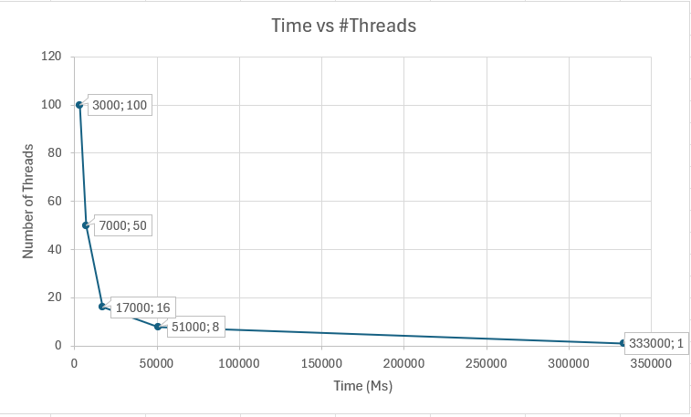

---
## University Computer

### Test 1 Thread

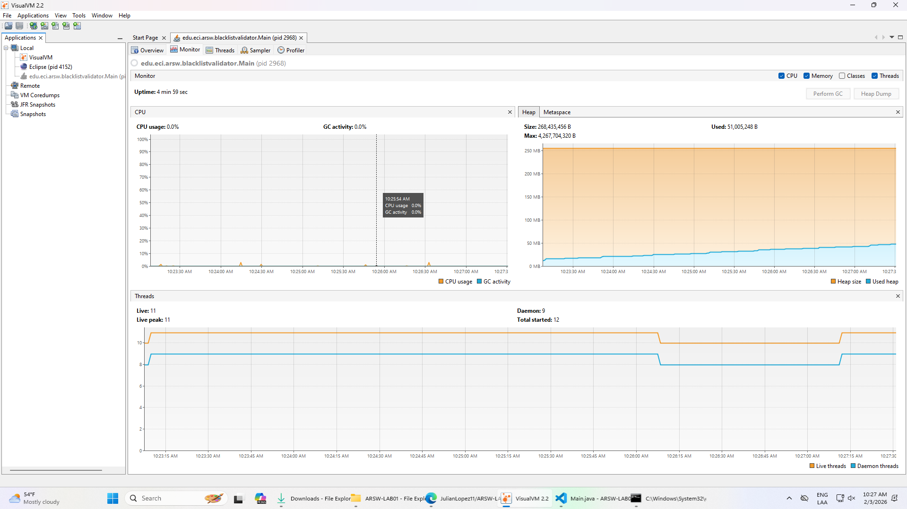


### Test # Cores Thread

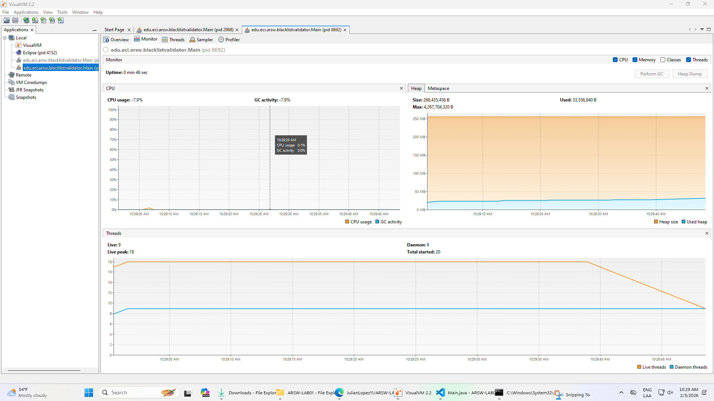

### Test # Cores x2 Thread

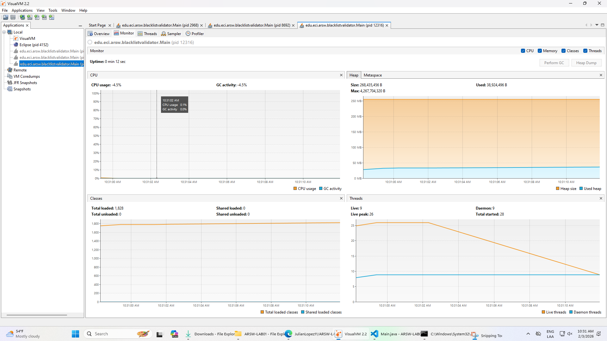


### Test 50 Threads

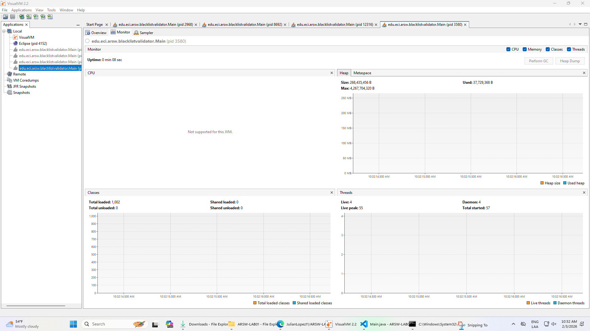


### Test 100 Thread

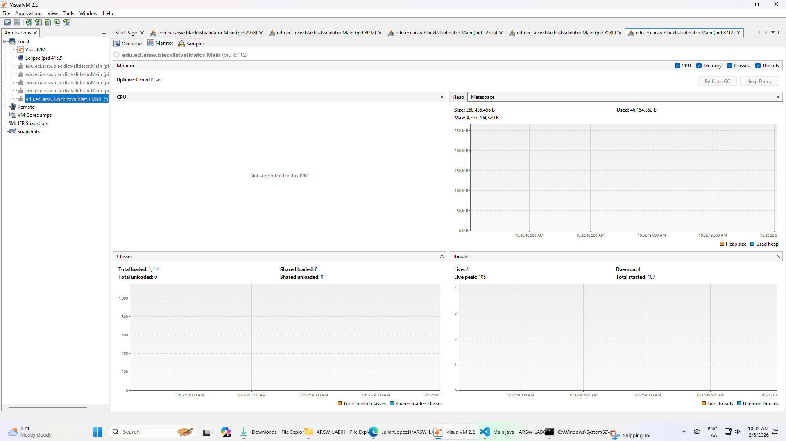

## Graph of solution time(ms) vs. number of threads University Computer

### Data

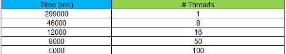

### Graphic

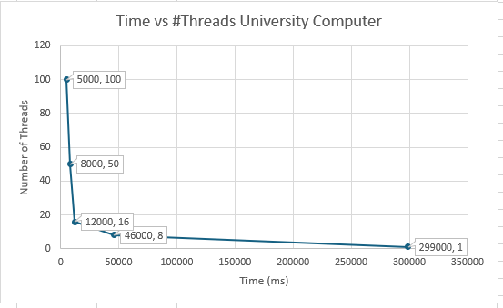

---


## 🧵 Part 4 : Exercise Black List Search

According to Amdahl's Law:


where S(n) is the theoretical performance improvement, P is the parallelizable fraction of the algorithm, and n is the number of threads. The larger n is, the greater the improvement should be.

### Why isn't the best performance achieved with 500 threads? How does this performance compare when using 200 threads?

As Amdahl's law states and based on the graph made earlier, the more threads the performance is almost the same forming a type of "asymptote" where it remains almost constant where there is a high cost due to the creation and context switching between threads. On the other hand, with 200 threads a better balance is achieved between parallelism and overhead, so the execution time will be less than with 500.

### How does the solution behave using as many processing threads as cores compared to the result of using twice as many?

When using as many processing threads as processor cores, each thread will be able to execute in parallel thus making better use of the CPU and minimizing the time spent on managing the executed threads, while when using twice as many, the threads will compete for the cores which will cause the time spent to increase and the performance does not improve.

### Based on the above, if for this problem, instead of 100 threads on a single CPU, one thread could be used on each of 100 hypothetical machines, would Amdahl's Law apply better?

Yes, I consider that 1 thread could be better used in 100 hypothetical machines because the parallelism would be more distributed and would be seen better applied since each thread executes in its own memory and CPU and there will be no "competition" between them for resources.

### If, instead, c threads were used on 100/c distributed machines (where c is the number of cores on these machines), would the performance improve? Explain your answer.

Yes, this scenario would improve performance a bit more, since the parallelizable fraction of the program remains constant; only the work is redistributed between a greater or lesser number of processors with c threads each.

## Authors

* **Julian Camilo Lopez Barrero** - [JulianLopez11](https://github.com/JulianLopez11)

