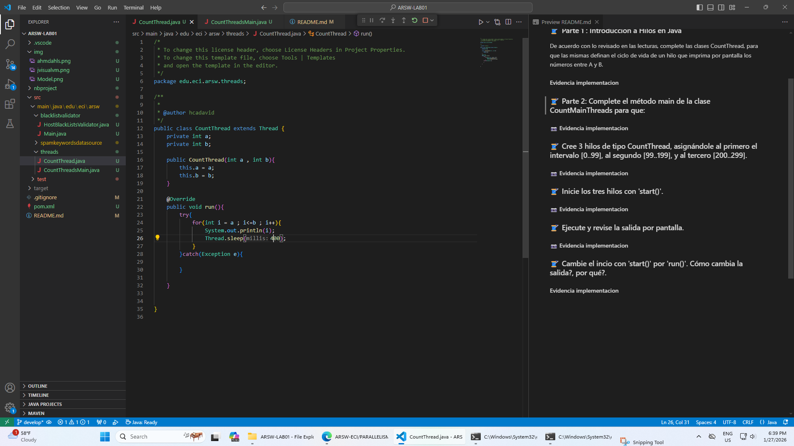
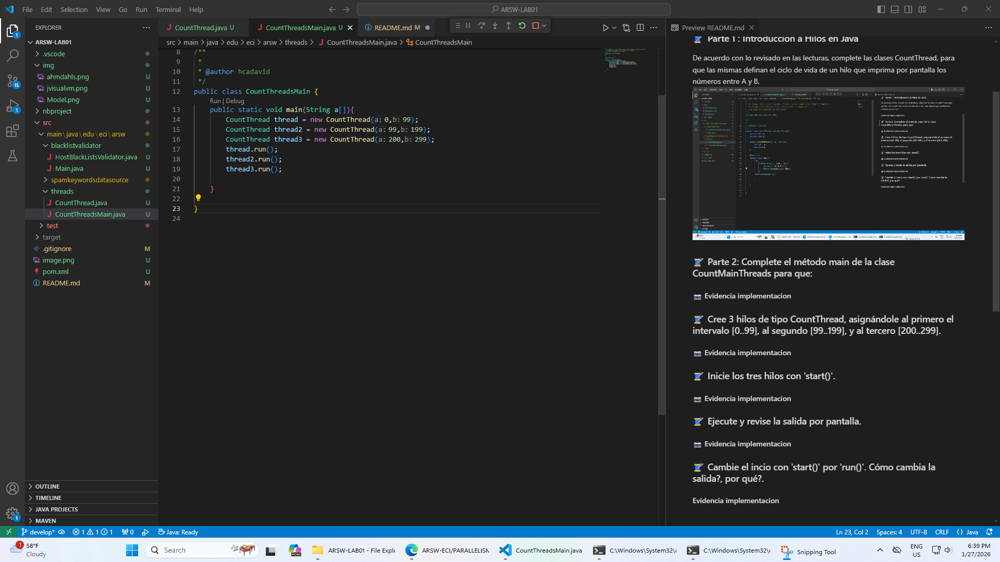
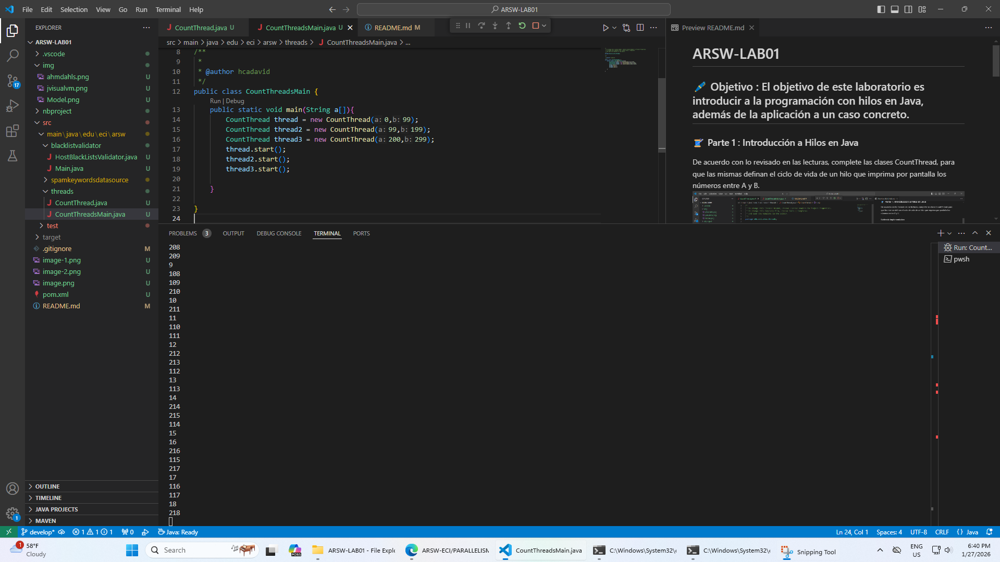

# ARSW-LAB01

## Julian Camilo Lopez Barrero 

## 🖊️ Objetivo : El objetivo de este laboratorio es introducir a la programación con hilos en Java, además de la aplicación a un caso concreto.

### 🧵 Parte 1 : Introducción a Hilos en Java
De acuerdo con lo revisado en las lecturas, complete las clases CountThread, para que las mismas definan el ciclo de vida de un hilo que imprima por pantalla los números entre A y B.

### Parte 2: Complete el método main de la clase CountMainThreads para que:

### Cree 3 hilos de tipo CountThread, asignándole al primero el intervalo [0..99], al segundo [99..199], y al tercero [200..299].

### Inicie los tres hilos con 'start()'.

### Ejecute y revise la salida por pantalla.

### Cambie el incio con 'start()' por 'run()'. Cómo cambia la salida?, por qué?.
La salida se ejecuta hilo por hilo hasta llegar al valor final de el utlimo en este caso 299 porque lo que hace start es ejectutar los hilos sin un orden especifico por lo cual estos se ejecutaran sin este orden mientras que con el run se ejecuta por el orden asignado en este main

