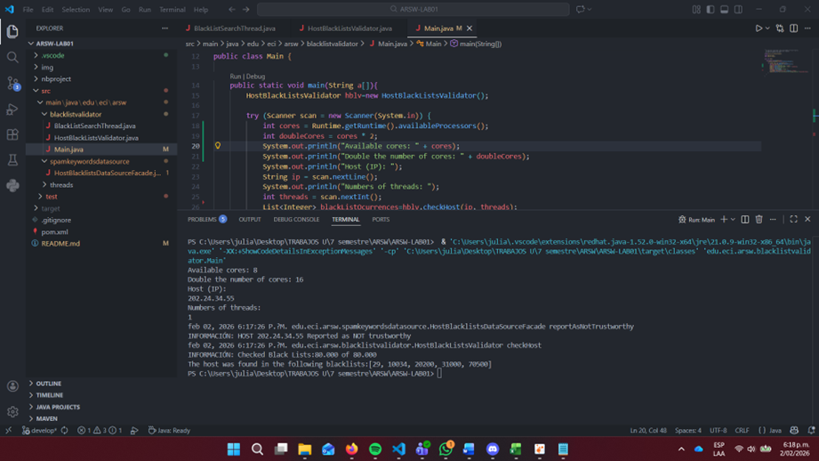
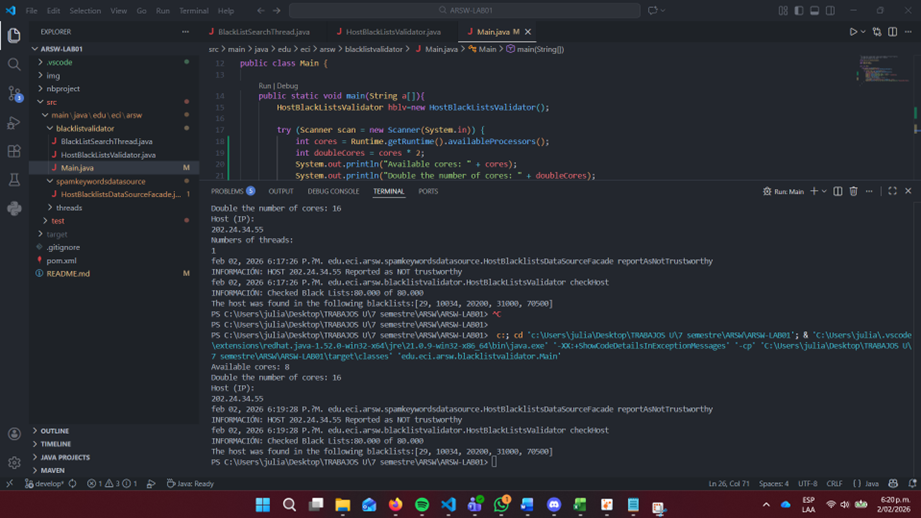
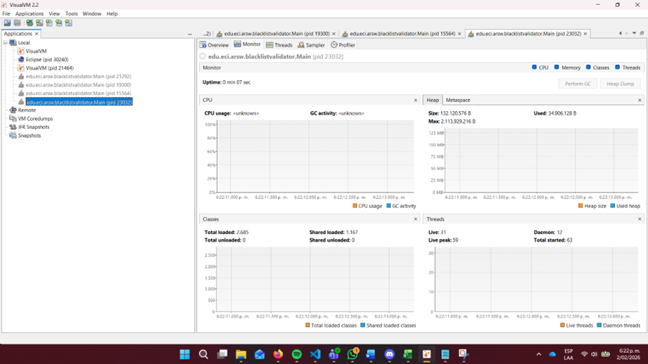

# ARSW-LAB01

## 🖊️ Objetivo

---
 
El objetivo de este laboratorio es introducir la programación con hilos en Java, así como su aplicación a un caso específico.

### Requisitos previos

---

Asegúrate de tener lo siguiente instalado:

- [Java JDK 8+](https://www.oracle.com/java/technologies/javase-downloads.html)
- [Apache Maven](https://maven.apache.org/)

### Instalación

---

1. Clona este repositorio en tu máquina local:
   ```bash
    git clone <URL_DEL_REPOSITORIO>
    ```
2. Navega al directorio del proyecto
    ```bash
    cd <NOMBRE_DEL_PROYECTO>
    ```

3. Ejecuta el proyecto.

## Construido con

* [Maven](https://maven.apache.org/) - Gestión de dependencias
* [Java](https://www.oracle.com/java/) - Lenguaje de programación

## 🧵 Parte 1 : Introducción a Hilos en Java

---

### Parte 1.2 Basándote en lo que has leído, completa las clases CountThread para que definan el ciclo de vida de un hilo que imprime los números entre A y B en la pantalla.

---


### Parte 1.1: Completa el método main de la clase CountMainThreads para que:

---

### Crea 3 hilos CountThread, asignando al primero el rango [0..99], al segundo [99..199], y al tercero [200..299].


### Inicia los tres hilos con 'start()'.


### Ejecuta el programa y revisa la salida en la pantalla.


### Cambia start() por 'run()'. ¿Cómo cambia la salida? ¿Por qué?
La salida se ejecuta hilo por hilo hasta alcanzar el valor final del último, en este caso 299, porque lo que start (concurrente) hace es ejecutar los hilos sin un orden específico, por lo que se ejecutarán sin este orden, mientras que con run se ejecuta en el orden asignado o comúnmente llamado ejecución secuencial en este main


## 🧵 Parte 2 : Ejercicio Búsqueda en Lista Negra

---

### Parte 2.1. Crea una clase Thread que represente el ciclo de vida de un hilo buscando en un segmento del grupo de servidores disponibles. Añade un método a esta clase que te permita consultar a las instancias de los hilos cuántas instancias de servidores maliciosos han encontrado o han encontrado.


---

### Parte 2.2


---


## 🧵 Parte 3 : Evaluación del Desempeño

En base a lo anterior, implementa la siguiente secuencia de experimentos para validar direcciones IP dispersas (por ejemplo, 202.24.34.55), registrando los tiempos de ejecución (asegúrate de hacerlos en la misma máquina):

### Prueba 1 Hilo

El CPU funcionó alrededor del 0.0% - 0.7%


---


### Prueba # De Núcleos 

En este caso mi portátil tiene 8, por lo que la prueba será con este valor 
El CPU funcionó alrededor del
 
El CPU funcionó alrededor del 0.0% - 2.8%


---

---

### Prueba # De Núcleos x 2 

El CPU funcionó alrededor del 0.0% - 4.0%


---


### Prueba 50 Hilos

El CPU funcionó alrededor del 0.0% 


---


### Prueba 100 Hilos

El CPU funcionó alrededor del 0.0% 


---


## Gráfica de tiempo de solución (ms) vs. número de hilos

### Datos


### Gráfica


---

## 🧵 Parte 4 : Ejercicio Búsqueda en Lista Negra

De acuerdo con la Ley de Amdahl:


donde S(n) es la mejora teórica del rendimiento, P es la fracción paralelizable del algoritmo, y n es el número de hilos. Cuanto mayor sea n, mayor será la mejora.

### ¿Por qué no se logra el mejor rendimiento con 500 hilos? ¿Cómo se compara este rendimiento al usar 200 hilos?

Como lo dice la ley de Amhal y basándonos en la grafica realizada anteriormente a mayor hilos el rendimiento tiene casi siendo el mismo formando un tipo de "asintota" donde este sigue casi constante donde alli se tiene un costo alto por la creación y cambio de contexto entre los hilos. En cambio con 200 hilos se logra mas un equilibrio entre paralelismo y sobrecarga entonces el tiempo de ejecucion será menor que con 500.

### ¿Cómo se comporta la solución utilizando tantos hilos de procesamiento como núcleos en comparación con el resultado de usar el doble?

Cuando se usan tantos hilos de procesamiento como núcleos del procesador cada hilo va a poder ejecutarse en paralelo asi aprovechando mejor la CPU y minimizando el tiempo invertido en la gestion de los hilos ejecutados mientras que al usar el doble los hilos lo que harán sera competir por los nucleos lo que hará que el tiempo invertido aumente y el desempeño no mejore

### Basándote en lo anterior, si para este problema, en lugar de 100 hilos en una sola CPU, se pudiera usar un hilo en cada una de 100 máquinas hipotéticas, ¿se aplicaría mejor la Ley de Amdahl? 

Si, considero que se podria usar mejor 1 hilo en 100 maquinas hipoteticas porque el paralelismo seria mas distribuido y se veria mejor aplicado ya que pues cada hilo se ejecuta en su propia memoria y CPU y no habrán "peleas" entre estos por recursos 

### Si, en cambio, se usaran c hilos en 100/c máquinas distribuidas (donde c es el número de núcleos en estas máquinas), ¿mejoraría el rendimiento? Explica tu respuesta.

Sí, este escenario mejoraría un poco más el desempeño, ya que la fracción paralelizable del programa se mantiene constante; únicamente se redistribuye el trabajo entre un mayor o menor número de procesadores con c hilos cada uno.
## Autor

* **Julian Camilo Lopez Barrero** - [JulianLopez11](https://github.com/JulianLopez11)

