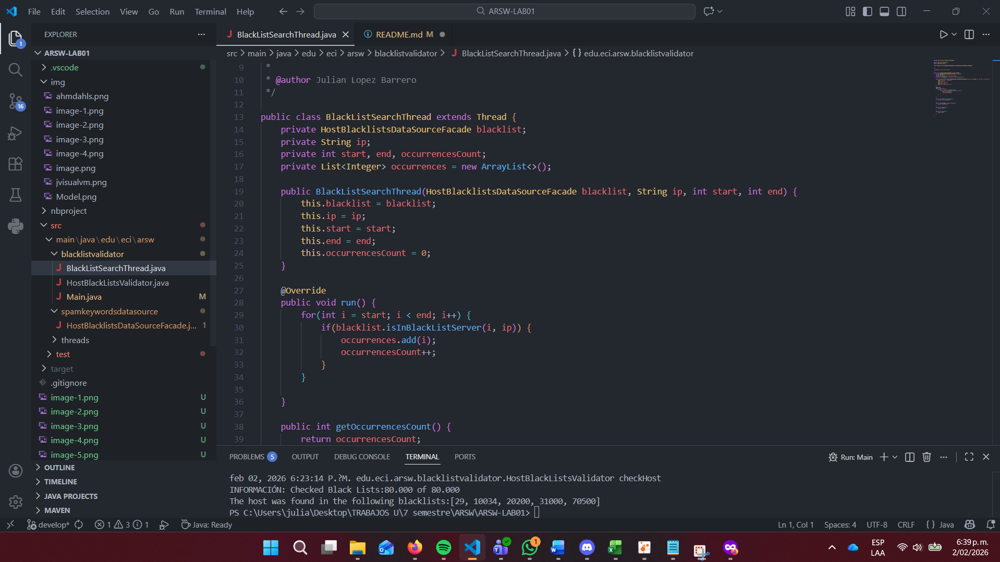

# ARSW-LAB01

## Julian Camilo Lopez Barrero 

## 🖊️ Objetivo
 
The objective of this lab is to introduce threaded programming in Java, as well as its application to a specific case.

### Prerequisites

Make sure you have the following installed:

- [Java JDK 8+](https://www.oracle.com/java/technologies/javase-downloads.html)
- [Apache Maven](https://maven.apache.org/)

### Installing

1. Clone this repository on your local machine:
   ```bash
    git clone <URL_DEL_REPOSITORIO>
    ```
2. Navigate to the project directory
    ```bash
    cd <NOMBRE_DEL_PROYECTO>
    ```

3. Run the project.

## Built With

* [Maven](https://maven.apache.org/) - Dependency Management
* [Java](https://www.oracle.com/java/) - Programming Language

### 🧵 Part 1 : Introduction to Threads in Java

### Part 1.2 Based on what you've read, complete the CountThread classes so that they define the lifecycle of a thread that prints the numbers between A and B to the screen.


### Part 1.1: Complete the main method of the CountMainThreads class so that:

### Create 3 CountThread threads, assigning the first the range [0..99], the second [99..199], and the third [200..299].


### Start all three threads with 'start()'.


### Run the program and review the output on the screen.


### Change the start with 'start()' to 'run()'. How does the output change? Why?
The output is executed thread by thread until it reaches the final value of the last one, in this case 299, because what start (concurrent) does is execute the threads without a specific order, so they will execute without this order, while with run it executes in the assigned order or commonly called sequential execution in this main


### 🧵 Part 2 : Exercise Black List Search

### Part 2.1. Create a Thread class that represents the lifecycle of a thread searching for a segment of the available server pool. Add a method to this class that allows you to query the instances of the threads for how many instances of malicious servers they have found or have found.



### Part 2.2


### 🧵 Part 3 : Performance Evaluation

## Authors

* **Julian Camilo Lopez Barrero** - [JulianLopez11](https://github.com/JulianLopez11)

